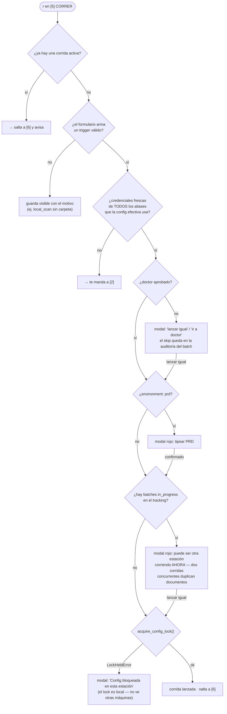
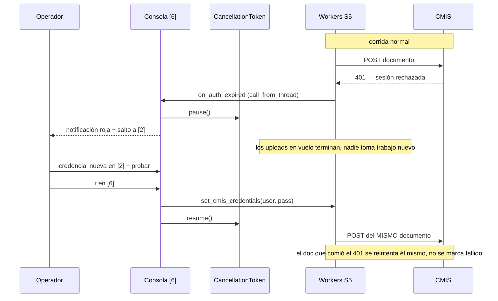
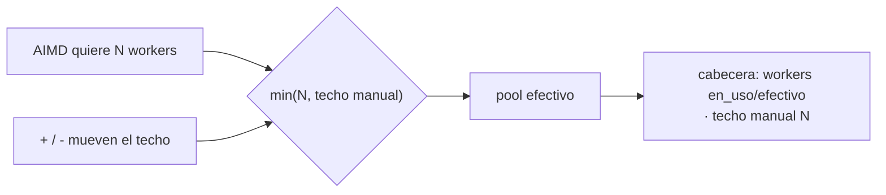
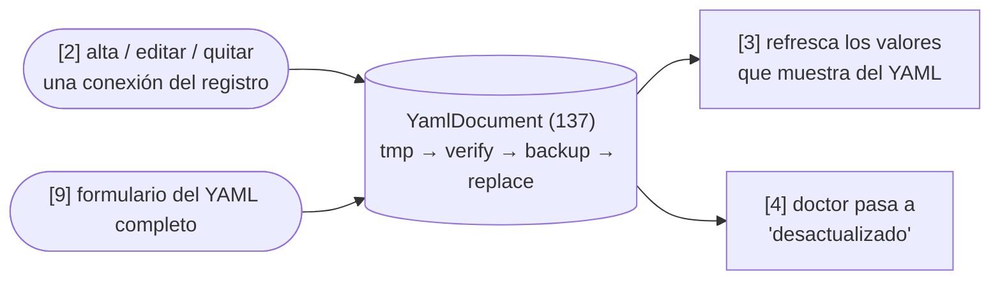
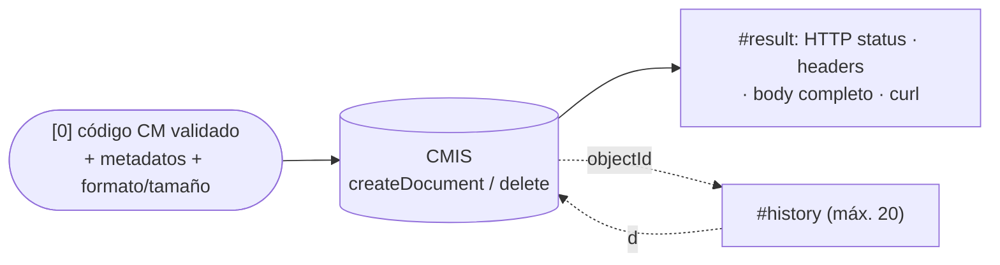

# Flujo de la consola de operación

> [← Volver al índice](../INDEX.md) · [Diagramas](README.md)

`cmcourier console` (123–135) no es un menú: es una máquina de estados con guardas. El operador no puede lanzar una corrida sin haber pasado por las credenciales y por el doctor, no puede escribir el YAML sin haber aplicado los overrides, y no puede aplicar un `recover` sin haber simulado antes. Cada una de esas barreras existe porque el camino equivocado cuesta caro contra producción.

Este diagrama muestra el orden real, no las diez pestañas sueltas.

## El recorrido de una corrida

```mermaid
stateDiagram-v2
    direction TB

    [*] --> Abierta: cmcourier console --config X<br/>(el YAML se valida acá; si no carga, exit 2)

    Abierta --> Credenciales: [2]
    state Credenciales {
        [*] --> SinProbar
        SinProbar --> Probando: ↵ / probar conexión
        Probando --> OK: chip verde · NN ms
        Probando --> Error: 401 / driver / credencial vacía
        Error --> Probando
        OK --> SinProbar: editar el campo invalida la prueba
        OK --> SinProbar: pasaron 45 min (CRED_TTL_S)
    }

    Credenciales --> Config: [3]
    state Config {
        [*] --> Borrador
        Borrador --> Aplicado: a (valida rangos)
        Borrador --> Borrador: valor inválido → error, no promueve
        Aplicado --> YAML: w (135)
        note right of YAML
            Sólo los 7 escalares.
            Backup config.yaml.bak-YYYYmmdd-HHMMSS
            Verifica el resultado ANTES de tocar
            el original; si no coincide, no escribe.
        end note
    }

    Config --> Doctor: [4]
    state Doctor {
        [*] --> SinCorrer
        SinCorrer --> Corriendo: d
        Corriendo --> Aprobado
        Corriendo --> ConFallas
        Corriendo --> Parcial: se corrió un grupo o un check suelto
        Aprobado --> Desactualizado: cambió una credencial,<br/>un override o el pipeline
        Desactualizado --> Corriendo: d
    }

    Doctor --> Launcher: [5]
    Launcher --> Corrida: r (pasa las guardas)
    Launcher --> Launcher: r bloqueado por una guarda

    state Corrida {
        [*] --> Corriendo
        Corriendo --> Pausada: p · o un 401 de CMIS (132)
        Pausada --> Corriendo: r
        Corriendo --> Drenando: x · o --max-duration vencido
        Drenando --> Cerrada: los uploads en vuelo terminaron
        Corriendo --> Cerrada: se acabó el trabajo
    }

    Corrida --> Batches: [7] retry / export
    Batches --> Launcher: R → modo reanudar
    Corrida --> [*]: q (confirma; salir NO cancela)
```

## La cadena de guardas del launcher

Apretar `r` en `[5]` no lanza: entra a una cadena. Cada eslabón que no se cumple abre un modal cuya **opción segura tiene el foco**.

Las guardas están ordenadas de barata a cara: primero lo que se resuelve leyendo memoria, después lo que consulta la SQLite, y el lock del sistema de archivos al final. Ninguna es un bloqueo duro salvo el lock — el operador siempre puede seguir, pero nunca por accidente, y el skip queda registrado.

## Pausa, 401 y techo de workers

Las tres teclas de `[6]` tocan la misma corrida en vuelo, por caminos distintos.

Si el operador reanuda sin haber probado la credencial nueva, la consola pide confirmación antes — y si el tercer 401 consecutivo del mismo documento llega igual, ése sí se marca `S5_FAILED` y aparece en `[7]` para retry.

`+` / `-` es otra cosa: no toca el token, mueve un techo.

El techo gana siempre, porque es la decisión explícita de una persona que está mirando el sistema. El AIMD sigue corriendo debajo y sigue viendo el valor cappeado, así que cuando el operador sube el techo el controlador retoma desde ahí en vez de empezar de cero. El techo es **de la corrida**: la próxima arranca sin él.

## Quién escribe el YAML

`[2]` (138) y `[9]` (139) son los dos caminos que tocan el archivo completo — a diferencia de `[3]`, que sólo persiste sus siete escalares (135). Los dos pasan por el mismo escritor (`YamlDocument`, 137: temporal en el mismo directorio, verificación con `load_config`, backup, reemplazo atómico) y los dos dejan rastro en el resto de la consola.

`connections:` sólo se edita desde `[2]`: en `[9]` aparece de sólo lectura, y un sitio con una conexión inline se muestra como `(inline — editar en [2])`.

## El tiro de prueba, aparte de la corrida

`[0] PRUEBA` (141) no entra en la máquina de estados de arriba: no pasa por el launcher, no exige un doctor aprobado y no deja rastro en el tracking. Habla directo con CMIS, un solo POST por vez.

Sin flecha hacia `Batches` ni hacia `migration_log`: lo que sube `[0]` no existe para el pipeline salvo que el operador lo suba de nuevo por un canal real. El único camino de vuelta es el propio operador borrándolo con `d`.

## Convenciones de estos diagramas

- Mermaid, texto en git, render nativo en GitHub — como el resto de `docs/diagrams/`.
- Los nombres de tecla, campo y método salen del código (`cli/console/`), no de las specs.
- Las pestañas se nombran `[N]` igual que en la consola y en la ayuda `?`.

## Ver también

- [`explanation/operations-console.md`](../explanation/operations-console.md) — el porqué de cada una de estas decisiones
- [`diagrams/sync-subsystem.md`](sync-subsystem.md) — qué hay detrás de la pestaña `[8]`
- [`reference/cli.md`](../reference/cli.md#console--consola-de-operación-123135) — flags, pestañas y tabla de teclas
- [`how-to/probar-la-consola.md`](../how-to/probar-la-consola.md) — el recorrido guiado contra un Alfresco local
- [`explanation/aimd-auto-tuning.md`](../explanation/aimd-auto-tuning.md) — el controlador que el techo manual acota
