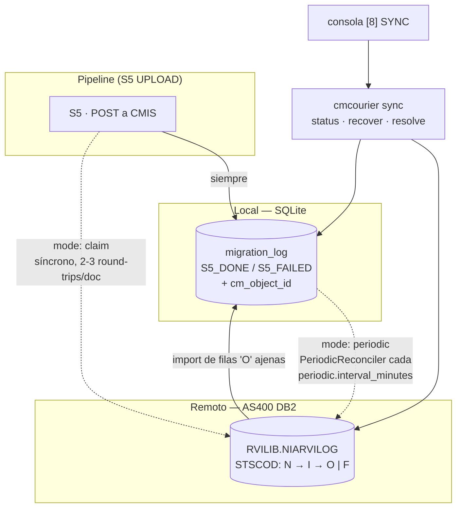
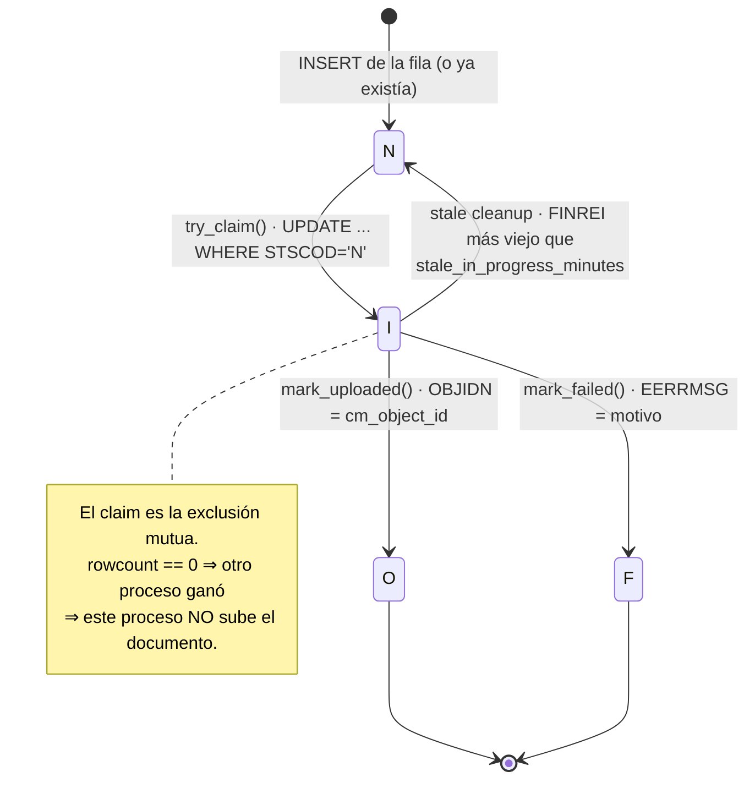
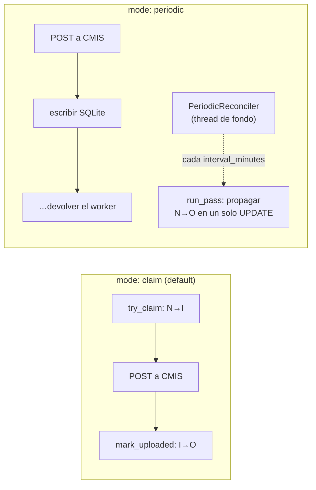
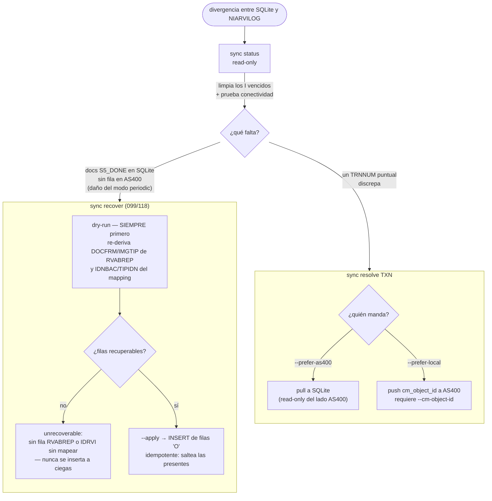
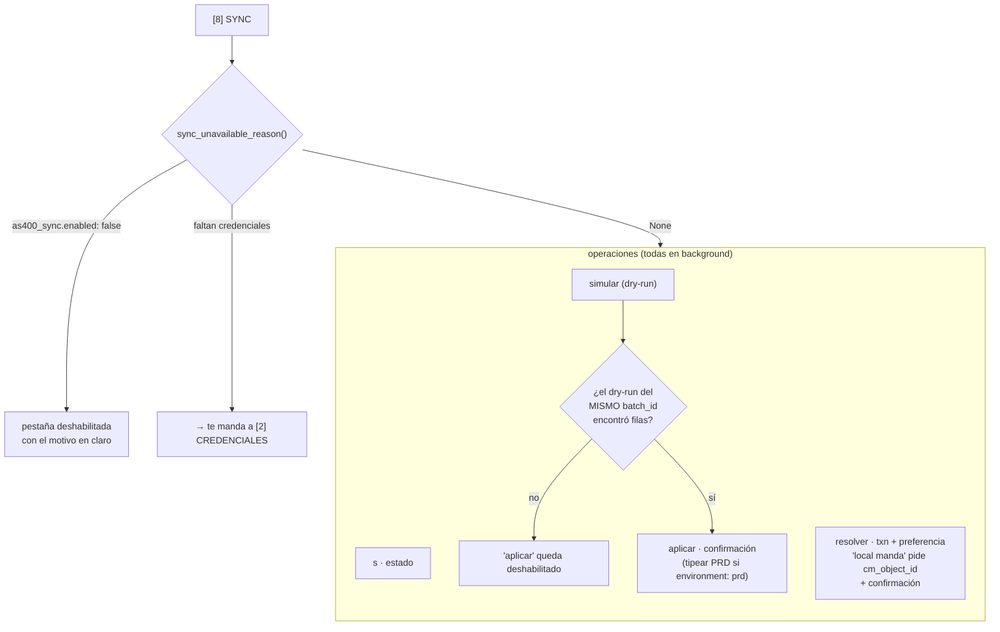

# Subsistema de sync — SQLite ↔ AS400 NIARVILOG

> [← Volver al índice](../INDEX.md) · [Diagramas](README.md)

CMCourier lleva **dos** libros de contabilidad de la migración. El local es la SQLite de `tracking.db_path` (`migration_log`), que existe siempre. El remoto es la tabla `RVILIB.NIARVILOG` en el AS400, que existe sólo si `tracking.as400_sync.enabled: true` (034).

El local alcanza para idempotencia dentro de una estación. El remoto existe porque el banco corre CMCourier desde varias estaciones contra el mismo Content Manager, y también porque los sistemas legacy del banco leen NIARVILOG para saber qué documento migró y a qué objeto CM fue a parar. `tracking.as400_sync.mode` (096) elige **cuándo** se escribe la fila remota, y esa elección es un tradeoff duro entre seguridad y latencia.

## Las dos bases y quién las escribe

Las flechas punteadas son mutuamente excluyentes: el `mode` elige una.

## `STSCOD` — la máquina de estados remota

| `STSCOD` | Qué significa |
|----------|---------------|
| `N` | New — la fila existe, nadie la tomó. |
| `I` | In progress — alguien la reclamó y está subiendo. |
| `O` | Ok — subida, con `OBJIDN` = el `cm_object_id` de Content Manager. |
| `F` | Failed — con el motivo en `EERRMSG`. |

El `I` es el estado peligroso: si el proceso que reclamó la fila muere, queda pegada. Por eso `sync status` (y el arranque de una corrida) corre el cleanup que devuelve a `N` toda fila `I` cuyo `FINREI` sea más viejo que `stale_in_progress_minutes` (default 30).

## `claim` vs `periodic`

`claim` paga 2-3 round-trips DB2 **síncronos por documento** y a cambio garantiza que dos migradores concurrentes no suban el mismo documento dos veces: el `UPDATE ... WHERE STSCOD='N'` es atómico, y el que ve `rowcount == 0` se abstiene.

`periodic` saca al AS400 del camino crítico — S5 escribe sólo SQLite y un `PeriodicReconciler` propaga en lote. Es mucho más rápido, y **no previene el doble-upload**: los conflictos se detectan post-hoc. Sólo tiene sentido si sabés que no hay un migrador competidor. Desde 117 la propagación de un documento ya terminado es un único `UPDATE` guardado por `STSCOD='N'` (el paso por `I` era puro round-trip), y desde 098 una pasada nunca levanta excepción ni pierde un ítem: lo que falla vuelve a la cola (`requeued`).

## Los tres comandos de reconciliación

La regla del `recover` es que **nunca inserta a ciegas**: si un `txn` no tiene fila RVABREP, o su `IDRVI` no está en el Modelo Documental, no hay forma de derivar `DOCFRM`/`IMGTIP`/`IDNBAC`/`TIPIDN` y la fila se reporta como `unrecoverable` en vez de inventarse. Por eso el dry-run no es una cortesía: es el paso donde ves qué se va a escribir antes de escribirlo.

## La pestaña `[8]` de la consola

`cmcourier console` expone exactamente estas tres operaciones — el mismo módulo `cli/sync_ops.py`, no una reimplementación (128).

El gate del `aplicar` es la parte interesante: no alcanza con haber corrido *un* dry-run, tiene que ser el del **mismo `batch_id`** y tiene que haber encontrado filas. Es la misma idea que el interlock de `prd` en el launcher — hacer que el camino destructivo requiera un paso previo deliberado.

## Ver también

- [`explanation/idempotency-and-retries.md`](../explanation/idempotency-and-retries.md) — la state machine local y la política de retry
- [`explanation/operations-console.md`](../explanation/operations-console.md) — por qué la consola envuelve estos comandos
- [`diagrams/console-flow.md`](console-flow.md) — la máquina de estados de la consola
- [`reference/cli.md`](../reference/cli.md#sync--as400-niarvilog-reconciliation-034) — flags exactos de `sync status | recover | resolve`
- [`how-to/as400-sync.md`](../how-to/as400-sync.md) · [`how-to/testing-as400-sync.md`](../how-to/testing-as400-sync.md)
- [`runbooks/as400-down.md`](../runbooks/as400-down.md) — qué hacer cuando el AS400 no responde a mitad de corrida
