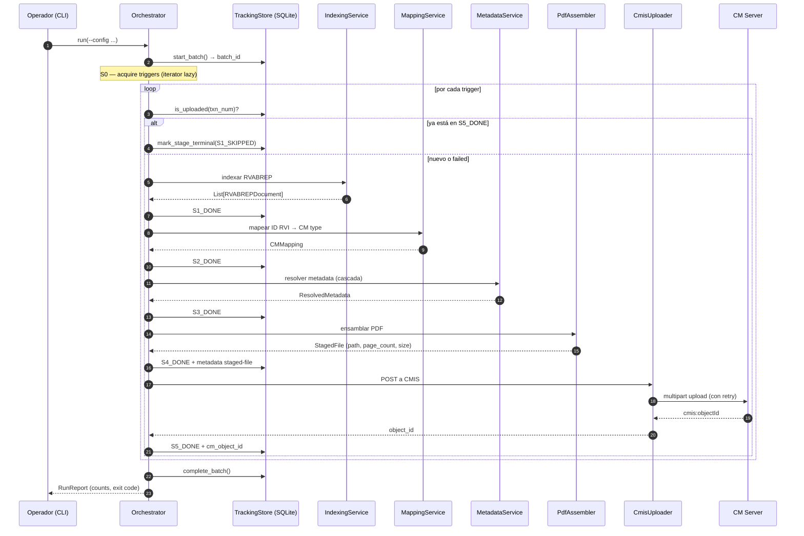

# Pipeline stages: la vida de un documento de S0 a S7

> [← Volver al índice](../INDEX.md) · [Explanation](README.md)

## El problema que estamos resolviendo

Migrar un documento del RVI de AS400 a Content Manager no es **una operación** — es **siete**. Hay que conseguir el trigger, indexarlo contra la tabla RVABREP, decidir qué tipo de CM le toca, resolver todos los campos de metadata, validar que los archivos físicos existan y ensamblar el PDF final, subirlo por CMIS, anotar el resultado para idempotencia. Cada una de esas operaciones puede fallar por motivos distintos, requiere recursos distintos, y se beneficia de paralelismos distintos.

El tool original mezclaba todo en un solo método. El resultado era el clásico: un fallo en la línea 800 no te decía si era un problema de red, de schema, de filesystem o de lógica. Imposible retrear "solo la parte del upload" porque no había "parte" — había un solo monolito.

CMCourier separa el ciclo de vida en **siete stages explícitos**, con contratos claros entre uno y otro y persistencia entre cada paso. Eso te compra observabilidad granular, retries quirúrgicos y testabilidad por capas.

## Los siete stages, de un vistazo

| # | Nombre | Responsabilidad | Servicio principal | Excepciones típicas |
|---|--------|------------------|--------------------|---------------------|
| S0 | Trigger acquisition | Sacar triggers de la fuente (CSV/RVABREP/local-scan) | `S0Strategy` (4 implementaciones) | `TriggerError` |
| S1 | Indexing | Querear RVABREP, descartar borrados (`ABACST`), expandir a `RVABREPDocument`s | `IndexingService` | `RVABREPNotFoundError`, `RVABREPDeletedError`, `RVABREPDuplicateError` |
| S2 | Mapping | Resolver ID RVI → CM type + folder destino | `MappingService` | `IDRViNotMappedError` |
| S3 | Metadata resolution | Resolver cada campo por la cascada de fuentes | `MetadataService` | `SourceFailedError` |
| S4 | Assembly | Validar archivos fuente y ensamblar el PDF | `PdfAssembler` (+ `ProcessPoolExecutor` post-066) | `SourceFileMissingError`, `PDFAssemblyFailedError` |
| S5 | Upload | POST a CMIS Browser Binding con retry/circuit breaker | `CmisUploader` (httpx HTTP/2) | `CMISClientError`, `CMISServerError`, `RetriesExhaustedError` |
| S6 | Tracking | Escribir estado a SQLite (y opcionalmente AS400 NIARVILOG) | `SQLiteTrackingStore`, `As400NiarvilogSync` | `TrackingError` (no propaga) |
| S7 | Idempotency marker | El check `is_uploaded()` que arranca la próxima corrida | `TrackingStore.is_uploaded()` | — |

S7 no es realmente "un stage que corre"; es el **gancho cross-batch** que la próxima corrida usa para saltar lo ya subido. Lo listamos para que la idempotencia tenga un nombre, no porque haya código que se ejecute "en S7" durante una corrida.

## El ciclo de vida visto desde la cola de tareas



Cada flecha hacia el `TrackingStore` es una transición de estado **persistida**. Esa persistencia es la base de la idempotencia y del resume.

## Stage por stage: en qué corre, qué tira, qué deja

### S0 — Trigger acquisition

**Qué hace**: convierte un descriptor de fuente (path del YAML, slug `rvabrep`, etc.) en un iterator lazy de `Trigger`s. Cuatro estrategias concretas:

- `CsvTriggerStrategy` — pandas, lee fila por fila, emite `ClientTrigger`.
- `DirectRvabrepTriggerStrategy` — escanea la fuente RVABREP (CSV o AS400), emite un trigger por fila.
- `LocalScanTriggerStrategy` — escanea un árbol de archivos, hace cross-check contra RVABREP.
- `SingleDocTriggerStrategy` — emite un solo trigger desde args de CLI.

**Dónde corre**: thread principal del orchestrator. El iterator es **lazy** — nunca materializamos la lista completa (Principio IV: streaming over buffering). Una migración de 200k triggers no carga 200k objetos en RAM.

**Qué tira**: `TriggerError` si la fuente está inalcanzable, malformada o vacía. Subclases: `RVABREPNotFoundError`, `RVABREPDeletedError`, `RVABREPDuplicateError`.

**Qué deja en el tracking store**: nada directamente en el camino feliz. S0 alimenta a S1; S1 es quien hace el primer INSERT a `migration_log`. La excepción son las **exclusiones** (148): una fila que la estrategia decide no migrar sale de S0 como `ExcludedTrigger` —un subtipo de `Trigger` que el dispatch de S1 no puede confundir con trabajo— y el orquestador le escribe su fila con `reason_code`. La estrategia **clasifica**; el orquestador **registra**: `services/` sigue sin ver el tracking store ni el `batch_id`.

**`filters.document_types` cambió de significado (148).** Antes, el allow-list de códigos se metía en el `IN` del SQL contra RVABREP: los documentos excluidos **nunca volvían del AS400** y por lo tanto eran invisibles por diseño — no se podían contar porque no existían. Hoy la consulta lleva **únicamente** `filters.systems`; el código nunca toca el SQL. La lista pasó de decir *"traeme sólo estos"* a decir *"de todo lo que traigas, migrá estos y contame el resto"*. El costo es real y hay que saberlo: la corrida trae más filas del origen y escribe filas de `migration_log` para documentos que no va a migrar. El beneficio es el censo. Como con `filters.systems` la corrida normal ahora arrastra un sistema entero, ese camino dejó de terminar en `fetchall()` y pasó a `stream_by_fields_in` (chunks del `IN` de 1000, `fetchmany` por lote).

### S1 — Indexing

**Qué hace**: por cada trigger, consulta la tabla RVABREP y expande el resultado en uno o más `RVABREPDocument`s (un trigger puede mapear a múltiples documentos físicos). Antes de devolver, descarta filas marcadas con código de baja (`ABACST` no vacío) — esas se reportan como `S1_FILTERED` en lugar de `S1_DONE` (spec 051), con `reason_code = DELETED_AT_SOURCE` (148). Cada borrado escribe su fila con **su `txn_num` real**: hasta 148 la clave era sintética (`FILTERED__{shortname}__{system_id}`) y, contra el índice único `(rvabrep_txn_num, batch_id)` con `INSERT OR IGNORE`, N documentos borrados del mismo cliente colapsaban en 1 sola fila.

También chequea idempotencia cross-batch acá: si `tracking.is_uploaded(txn_num)` devuelve `True`, el doc se anota como `S1_SKIPPED` (spec 062) con `reason_code = ALREADY_UPLOADED` y no avanza. Pre-062 el skip era silencioso; ahora deja rastro auditable.

**S1 es también quien cuenta el origen** (148 REQ-005). A medida que ve documentos llama a `increment_source_total`, que suma en SQL — el total no se conoce de antemano (S1 ve chunks y streaming nunca sabe cuántos hay) y con la suma del lado de la base N workers suman exacto. Ése es el denominador contra el que todo lo demás tiene que cerrar, y reemplaza al `total_records` viejo, que era el `batch_size` configurado en batched y un `0` pelado en streaming.

**Dónde corre**: en modo batched, dentro de los `prep_workers` (threads). En modo streaming, dentro de los **producers** del bucket. Es I/O-bound (espera la respuesta de RVABREP), así que threads escalan bien.

**Qué tira**: `RVABREPNotFoundError`, `RVABREPDeletedError`, `RVABREPDuplicateError`, `IndexingError`.

**Qué deja en tracking**:
- `S1_PENDING` al arrancar.
- `S1_DONE` al terminar con éxito.
- `S1_SKIPPED` si ya está en `S5_DONE` por una corrida previa (cross-batch idempotency).
- `S1_FILTERED` si todas las filas RVABREP están con código de baja.

### S2 — Mapping

**Qué hace**: tres cosas, en este orden.

**(1) Resuelve la identidad del cliente** (147). RVABREP no siempre la trae: a veces viene sólo el shortname, a veces sólo el CIF, a veces ninguno de los dos y lo único disponible es un afiliado hijo. El bloque `identity:` del YAML declara qué campo alimenta cada slot (`shortname` / `cif` / `system_id`) y esos campos se resuelven con el **mismo motor de `field_sources`** que usa S3, así que un slot puede llegar después de tres saltos encadenados (hijo → padre → shortname → CIF). El resultado es un `ResolvedIdentity` frozen que se cuelga del `_StageItem` y viaja con el documento hasta las tres escrituras: la fila de `migration_log`, `CTECIF`/`CTENUM` del log de AS400 y la clave del mapeo de acá abajo.

Los tres slots son opcionales, y un slot ausente deja el comportamiento pre-147 (el valor se lee del trigger, sin cadena). Ver [`how-to/identity-chain.md`](../how-to/identity-chain.md).

**(2) Evalúa la elegibilidad del cliente** (150). Content Manager no tiene espacio para todo RVABREP: la directiva de negocio es migrar sólo los documentos de clientes **con producto activo**, y el banco produce un CSV con el `Shortname` y el `CIF` de esos clientes. El bloque `eligibility:` declara contra qué fuente se la consulta y por qué columnas (`match_any`: basta con que UNA matchee). Corre **inmediatamente después de la identidad y antes del mapeo** — para saber si el cliente está activo hay que saber primero quién es el cliente. Un cliente que no está en la lista deja `CLIENT_NOT_ACTIVE` (balde `EXCLUIDO`) y **no avanza a S3**.

Es opcional entero: con `enabled: false` (el default) la fuente no se abre ni una vez y no se evalúa ningún documento — el comportamiento es el pre-150. La estructura del bloque (alias declarado, `match_any` no vacío, cada `field` existente) se valida igual al cargar el YAML, porque un alias mal escrito es un error de config esté la perilla donde esté. Ver [`how-to/client-eligibility.md`](../how-to/client-eligibility.md).

Dos consecuencias que conviene tener presentes:

- **Una lista rota no significa "nadie está activo".** Con la perilla prendida, el **preflight de la corrida** verifica que la fuente abra, tenga las columnas declaradas y tenga al menos una fila; si algo falla, la corrida **aborta** antes del primer documento. No se falla documento por documento: no se arranca. Si siguiera, emitiría un censo impecable diciendo que 200.000 documentos se excluyeron por cliente inactivo — un reporte prolijo y completamente falso. El mismo chequeo vive como check `eligibility_list` del `doctor`.
- **Ahorra espacio en Content Manager, no tiempo de proceso.** Un documento de un cliente inactivo paga igual toda la cadena del paso (1) antes de poder descartarse. Lo hace tolerable el memo por corrida: el primero de cada cliente paga los saltos, los demás van gratis. Las búsquedas contra la lista se memoizan con la clave `(fuente, columna, valor)`.

**(3) Traduce el `ID RVI`** (un identificador del modelo documental de RVI) al `cm_object_type` y la `cm_folder` correspondientes en Content Manager. La traducción se carga al startup desde un CSV (`MapeoRVI_CM.csv`) que mantiene el banco. Es un lookup en un dict.

En modo **manifest** (145, recomendado) el lookup es por `(sistema, ID RVI)`, no sólo por `ID RVI`: `MappingService.get_mapping` primero busca la fila específica del sistema que trajo el trigger (`domain/models.py:trigger_system_id`) y, si no hay, cae al comodín (`IDSistema` vacío). Esto permite que el mismo `ID RVI` resuelva a clases CM distintas según de qué sistema vino el documento — algo que los modos consolidado y split no soportan (ahí todo el mapeo vive bajo un único comodín implícito, sin distinguir sistema). El resto de `CMMapping` (tipo, carpeta, propiedades requeridas) sale del manifest JSON de tipos CM en vez de columnas del CSV — ver [`how-to/cm-type-manifest.md`](../how-to/cm-type-manifest.md).

Cuando `identity.system_id` está declarado, la primera mitad de esa clave sale de la identidad resuelta en el paso (1) en lugar del trigger crudo — el sistema también se puede resolver por cadena. Sin el slot declarado, sigue saliendo de `trigger_system_id(trigger)`, byte-idéntico al pre-147.

**Dónde corre**: mismo thread que S1 (el producer/prep_worker). **Ojo: desde 147, S2 puede hacer red.** Antes era CPU-trivial (un `dict.get()`); ahora, si el bloque `identity:` declara una cadena que necesita un lookup contra AS400 o SQL Server, S2 paga ese round-trip. Tres cosas lo acotan: la cadena se resuelve UNA vez por documento; cada salto se memoiza por corrida, así que todos los documentos del mismo cliente pagan el primero y nada más; y lo que S2 resolvió entra como **semilla** de S3, que por eso no vuelve a consultar ni el campo ni sus eslabones intermedios.

Se evaluó y se descartó darle etapa propia (una "S1.5") por costo: habría significado migrar `migration_log`, agregar estados nuevos a toda la máquina de recovery, a la consola y a los docs. Si la resolución de identidad resulta cara o falla seguido, se reconsidera con su propia spec.

**Qué tira**: `IDRViNotMappedError` cuando el ID RVI no aparece en el mapping cargado (ni para el sistema del trigger ni para el comodín). Y `IdentityResolutionError` (147) cuando un slot con `on_missing: fail` no resolvió; desciende de `MappingError` a propósito, así que **es un `S2_FAILED` con su motivo, no un estado nuevo**. El mensaje nombra el slot Y la cadena completa que se intentó, fuente por fuente y con el motivo de cada descarte — sin eso el operador ve "no resolvió el CIF" y no tiene forma de saber cuál de los tres saltos se cortó. Eso indica que el banco agregó un tipo nuevo al modelo documental y nadie actualizó el CSV. En modo manifest, un `IDCM` que el CSV referencia pero el manifest no conoce no levanta esta excepción — la fila se descarta con WARNING al cargar y el código queda en `MappingService.missing_cm_codes`, visible en `types check` / doctor `cm_manifest`.

**Qué deja en tracking**: `S2_PENDING` / `S2_DONE` / `S2_FAILED`.

### S3 — Metadata resolution

**Qué hace**: cada campo del `cm_object_type` resultante de S2 tiene una lista de **fuentes** y un valor por defecto. Las fuentes se prueban en orden — la primera que devuelve un valor válido gana. Si todas fallan se usa el `default_value`, al que se le aplica el `format` de campo (146) pero **no se lo valida contra nada** (149): el default lo escribe una persona a mano en el YAML, así que un default malo es un error de CONFIG y se arregla editando el archivo, no abortando documentos en producción. Si no hay `default_value`, se levanta `SourceFailedError`. La red de seguridad la corre `types check`, que informa (INFO) cuando el default ya formateado no matchea ningún `allowed_pattern` de sus fuentes.

Las fuentes pueden ser:
- `trigger:<campo>` — sacar del trigger original.
- `rvabrep:<campo>` — sacar de la fila RVABREP.
- `csv:<alias>` — querear una CSV de metadatos (clientes, cuentas, etc.).
- `as400:<alias>` — querear AS400.

Y la clave de búsqueda de esas dos últimas puede salir de otro campo ya resuelto (`lookup_value_source: "field.<NOMBRE>"`, 147): el resolver arma el grafo de dependencias, lo ordena topológicamente y resuelve en ese orden, sólo lo pedido más sus dependencias transitivas. Los campos que S2 ya resolvió para la identidad entran como semilla y no se vuelven a consultar.

Con `prefetch_enabled: True` (default), los CSV de metadatos se pre-cargan en memoria al startup; AS400 se queryea por documento. Con el cache de 037 activo (post-MVP §9), las resoluciones recientes se memoizan en SQLite con TTL.

**Dónde corre**: mismo thread que S1/S2. Es mixto — CSV es en memoria (rápido), AS400 es red (lento). De ahí que el cache exista.

**Qué tira**: `SourceFailedError`, `MetadataError`. (`DefaultValidationFailedError` quedó deprecada en 149: el runtime ya no la levanta.)

**Qué deja en tracking**: `S3_PENDING` / `S3_DONE` / `S3_FAILED`.

### S4 — Assembly

**Qué hace**: valida que los archivos físicos referenciados por `RVABREPDocument` existan en el `source_root` configurado. Después ensambla el PDF final:

- TIFFs multi-página → `img2pdf.convert(...)` (fast path, no decodifica)
- TIFFs con compresión LZW → Pillow (decodifica, recompone como PDF)
- PDFs → passthrough (los mete como están)
- JPEGs → img2pdf
- Múltiples archivos → PyPDF2 merge

**Dónde corre**: **acá hay magia importante**. Antes de la spec 066, corría inline en el thread del producer. Resultado: con `prep_workers: 16` el throughput era < 5 docs/s porque el GIL serializaba todo el trabajo de img2pdf+PIL+PyPDF2 (que son C extensions que no siempre liberan el GIL).

Post-066 (default `s4_use_processes: True`), S4 corre en un `ProcessPoolExecutor` con `multiprocessing.get_context("spawn")`. Cada proceso worker tiene su propio intérprete Python y su propio GIL, así que el paralelismo es real a nivel de SO. El thread productor hace `pool.submit(_pool_assemble, doc).result()` y se bloquea — pero **el bloqueo libera el GIL**, así que otros producers avanzan con S1/S2/S3 en paralelo.

Ver [`processpool-for-pdf-assembly.md`](processpool-for-pdf-assembly.md) para el detalle de por qué `spawn` y no `fork`.

**Qué tira**: `SourceFileMissingError` (con `__reduce__` para que pickle pueda cruzar el process boundary), `PDFAssemblyFailedError` (idem), `AssemblyError`.

**Qué deja en tracking**: `S4_PENDING` / `S4_DONE` / `S4_FAILED`. Cuando termina con éxito, también persiste la metadata del staged file (`source_file_path`, `page_count`, `file_size_bytes`) vía `record_staged_file_metadata` (spec 058).

### S5 — Upload

**Qué hace**: hace POST multipart al CMIS Browser Binding de IBM Content Manager. Incluye:

- Warmup del JSESSIONID (lazy, una vez por session lifetime).
- Verificación / creación recursiva de carpetas con cache en memoria.
- Upload streaming con `httpx[http2]` — el archivo se lee de disco bajo demanda.
- `BandwidthLimiter` opcional para redes corporativas con throttling.
- Retry policy diferenciada por tipo de error (ver [`idempotency-and-retries.md`](idempotency-and-retries.md)).

**Dónde corre**: en un `ThreadPoolExecutor` dimensionado por `cmis.workers` (resizable por AIMD). Cuando las heavy/light lanes están activas, se divide en dos pools (ver [`heavy-light-lanes.md`](heavy-light-lanes.md)).

**Qué tira**: `CMISClientError` (4xx — fail fast), `CMISServerError` (5xx — retry), `RetriesExhaustedError` (presupuesto agotado).

**Qué deja en tracking**: `S5_PENDING` / `S5_DONE` (con `cm_object_id`) / `S5_FAILED`.

### S6 — Tracking

**Qué hace**: persiste el resultado en SQLite. Implementación con WAL mode + writer thread separado + escritura batch (cola drenada cada ~500 items o 1 segundo).

Cuando `tracking.as400_sync.enabled = True`, también sincroniza a la tabla AS400 `NIARVILOG` (spec 034) — eso permite idempotencia distribuida entre múltiples instancias corriendo contra el mismo banco.

**Dónde corre**: el writer thread es un daemon separado. Los stages emiten por una `queue.Queue` y vuelven inmediato. **Las fallas de tracking NO bloquean el pipeline** (contrato): se loguean como `TrackingError` y se siguen. La regla es: si SQLite muere, perdemos observabilidad pero el upload ya está confirmado por CM — el daño está acotado.

**Qué tira**: `TrackingError`, pero **no propaga al caller**.

**Qué deja**: filas en `migration_log` con la state machine completa.

### S7 — Idempotency marker

**Qué hace**: no hay código que "corra" en S7. S7 es **la regla**: la próxima vez que arranque una corrida, el orchestrator llama `tracking.is_uploaded(txn_num)` al inicio de S1, y si devuelve `True`, el doc se marca `S1_SKIPPED` y no se procesa.

La implementación es un índice SQL:

```sql
INDEX ON migration_log (rvabrep_txn_num) WHERE status='S5_DONE'
```

Eso permite que `is_uploaded()` sea O(log n) y la corrida de un batch sobre 200k docs ya migrados termine en segundos sin tocar CMIS.

## El censo: todo documento del origen termina con una razón

Los siete stages contestan *"¿qué procesé?"*. El **censo** (spec 148) contesta la otra pregunta, que es la que se necesita para auditar una migración: *"¿qué había en el origen y qué pasó con cada cosa?"*.

Son preguntas distintas. Antes del censo, un rastreo encontró **19 caminos** por los que un documento del origen terminaba sin subirse: **dos** dejaban una razón legible por máquina y **ocho no escribían absolutamente nada**. Un documento podía desaparecer en silencio y el reporte no tenía cómo notarlo.

### Tres campos ortogonales, cero estados nuevos

El censo NO agregó estados a la máquina. Agregó un eje:

| Campo | Contesta | Ejemplo |
|---|---|---|
| `status` | **dónde** paró | `S2_FAILED` |
| `reason_code` | **por qué** | `CODE_NOT_MAPPED` |
| balde (derivado del código) | **quién** lo arregla | `BLOQUEADO` |

Que el `status` diga `FAILED` no lo vuelve un error de ejecución: el balde lo desmiente, y **el balde es lo que se reporta**. Esto fue deliberado — un estado nuevo se hubiera tenido que propagar por toda la máquina de recovery, la consola y los docs, y no habría contestado mejor la pregunta.

La taxonomía de `ReasonCode` es **cerrada** y el mapeo código → balde es **total**: un test itera el enum entero y exige que cada código tenga balde. El día que alguien agregue una razón y se olvide de mapearla, no pasa el CI en vez de desaparecer del reporte.

### Los tres baldes

| Balde | Significa | Quién lo resuelve |
|---|---|---|
| `EXCLUIDO` | Decisión del operador, o el origen dice que no | nadie, está bien así |
| `BLOQUEADO` | Falta configuración | el operador, editando YAML / CSV / manifest |
| `FALLO` | Se rompió en ejecución | reintento o investigación |

Cada balde se resuelve de una manera distinta y **por una persona distinta**; por eso el balde es la unidad del reporte y no el código. Qué hacer con cada uno, razón por razón, está en [`../how-to/operator/read-the-batch-census.md`](../how-to/operator/read-the-batch-census.md).

### Dónde se escribe

`migration_log` ganó dos columnas (DDL aditivo, `PRAGMA table_info` + `ALTER TABLE ADD COLUMN`):

- `reason_code TEXT` — el enum, `NULL` para los que subieron.
- `id_rvi TEXT` — el código RVI. **Hasta 148 no se guardaba en ninguna parte de la base**: vivía sólo en memoria, en `RVABREPDocument.index7`. Sin esa columna el censo no se puede agrupar por código, que es exactamente la pregunta del operador. Se llena siempre, no sólo en las exclusiones.

Los cuatro `CM_*` (`CM_TIMEOUT`, `CM_REJECTED_4XX`, `CM_ERROR_5XX`, `CM_TRANSPORT`) salen de `classify_failure`, que ya producía ese enum para las métricas: se conectó a la base, no se reinventó.

### La red que hace imposible perder un documento en silencio

El censo no es sólo un reporte. El caso que lo demuestra: en streaming, un `except BaseException` no-CMIS incrementaba el tally y **no persistía nada**; como `mark_stage_pending` es `INSERT OR IGNORE`, el documento quedaba registrado como `S4_DONE` y nunca se subía. Ése era el bug de los ~200 uploads perdidos — el operador buscaba el TXN en Content Manager y no estaba. Hoy ese camino termina en `S5_FAILED` + `CRASHED` y aparece en el censo.

### El cuadre

`batch show` cierra el reporte con una línea de cuadre: `migrados + censados` contra el total del origen. Si no da, lo dice con las palabras `!! DESCUADRE`, nombrando los dos números y la diferencia. **Un reporte que no cuadra y no avisa es peor que no tener reporte**: el primero te hace tomar decisiones sobre números falsos, el segundo al menos te obliga a ir a mirar.

## Por qué separar stages: el caso del retry quirúrgico

Imaginá que tu corrida cae en el medio. 8000 docs procesados, 200 con `S4_FAILED` (un share de red se cayó), 50 con `S5_FAILED` (CMIS devolvió 503 por mucho tiempo). Querés recuperar.

**Con stages**: `cmcourier batch retry-failed <batch_id> --stage S4_FAILED` resetea solo esas 200 filas a `S4_PENDING`. La próxima corrida arranca por S0, encuentra esos triggers, los reindexa, los re-mappea (rápido), los re-resuelve (cached), y se va directo a S4. Las otras 7800 ya en `S5_DONE` se saltean en S1. Las 50 de `S5_FAILED` se resetean separadas con otro `retry-failed --stage S5_FAILED` cuando CMIS vuelva.

**Sin stages** (un solo "DONE/FAILED"): no podés distinguir un fallo de filesystem de uno de red. Cualquier retry re-ejecuta todo desde cero. Para 200 docs eso es minutos extra; para 2000 son horas.

## Por qué separar stages: el caso de la observabilidad

`MetricsRecorder` mantiene un `_StageBucket` independiente por cada uno de S0–S7. Cada bucket calcula p50, p95, p99 y count separados. Cuando el sistema está lento, el resumen `batch_summary` te dice cuál stage la está chupando:

```
S1: p95=120ms count=5000
S3: p95=890ms count=4920   ← AS400 está lento
S4: p95=2400ms count=4900
S5: p95=18000ms count=4900 ← CMIS está peor todavía
```

Sin esa separación tendrías un solo número agregado y a debuggear a ciegas.

## Cómo se mapea esto a los modos de ejecución

En **modo batched** (default), `MultiBatchOrchestrator` divide los triggers en chunks de `batch_size`. El chunk K hace S1–S4 en su `prep_workers`-thread pool mientras el chunk K-1 hace S5 en el pool compartido — overlap N=2. Los stages **dentro de un chunk** son secuenciales por doc; el paralelismo es entre docs.

En **modo streaming** (spec 063), `StreamingOrchestrator` colapsa todo a un solo `batch_id` y monta un bucket entre los producers (que corren S1–S4) y los consumers (que corren S5). Ver [`streaming-vs-batched.md`](streaming-vs-batched.md).

En ambos modos, los stages siguen siendo siete y la state machine no cambia. Lo que cambia es **cómo se los coordina**.

## Ver también

- [`streaming-vs-batched.md`](streaming-vs-batched.md) — los dos modos que orquestan estos stages
- [`idempotency-and-retries.md`](idempotency-and-retries.md) — cómo se aplica la state machine para resume y retry
- [`architecture-overview.md`](architecture-overview.md) — la arquitectura que hace que esta separación se sostenga
- [`../how-to/operator/read-the-batch-census.md`](../how-to/operator/read-the-batch-census.md) — leer el censo balde por balde y saber qué hacer con cada razón
- la spec de dominio del proyecto — descripción canónica de RVABREP, CMIS y el modelo documental
