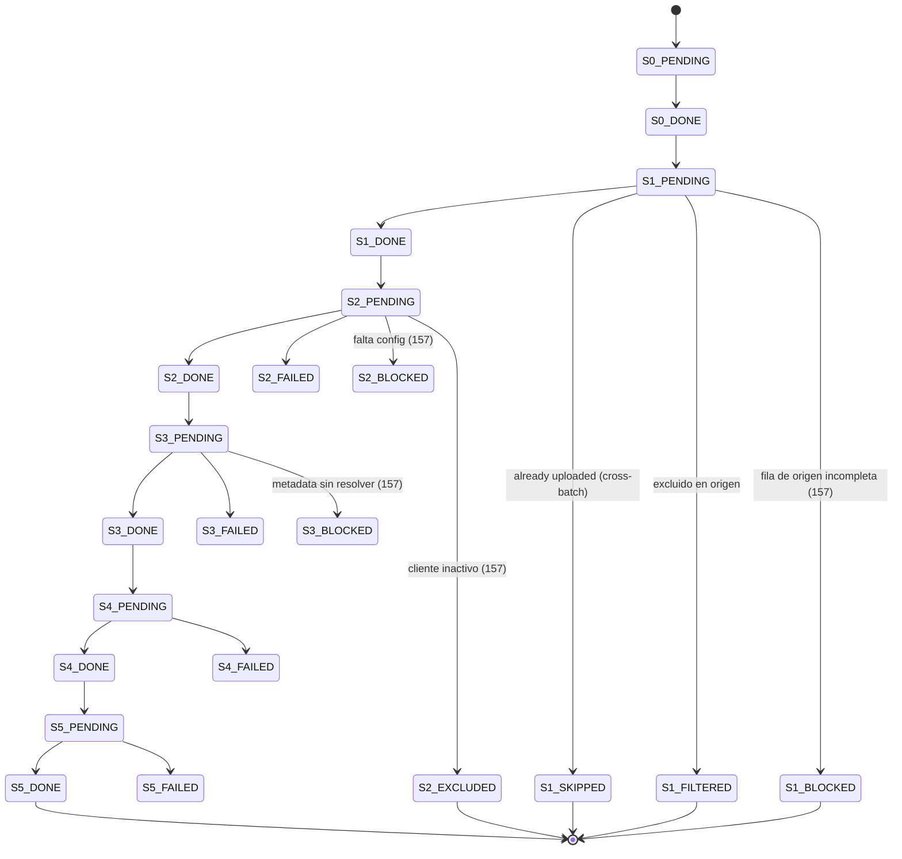

> [← Volver al índice](../INDEX.md) · [Reference](README.md)

# Tracking DB schema

SQLite DDL exacto de `tracking.db_path`. Las sentencias se ejecutan al abrir el store (`adapters/tracking/sqlite.py`). Modelo de concurrencia: WAL — un reader sincrónico en el thread principal + un writer thread daemon que drena una `queue.Queue` (hasta 500 sentencias o 1 s, lo que ocurra primero).

## PRAGMAs

```sql
PRAGMA journal_mode=WAL;
PRAGMA synchronous=OFF;
PRAGMA cache_size=-64000;    -- 64 MiB page cache
PRAGMA temp_store=MEMORY;
```

---

## Table `migration_log`

Una fila por documento por batch. La clave de idempotency es `(rvabrep_txn_num, batch_id)` + el partial index sobre `rvabrep_txn_num WHERE status='S5_DONE'`.

```sql
CREATE TABLE IF NOT EXISTS migration_log (
    id                  INTEGER PRIMARY KEY AUTOINCREMENT,
    trigger_shortname   TEXT    NOT NULL,
    trigger_cif         TEXT    NOT NULL,
    trigger_system_id   TEXT    NOT NULL,
    rvabrep_txn_num     TEXT    NOT NULL,
    rvabrep_file_name   TEXT    NOT NULL,
    batch_id            TEXT    NOT NULL,
    status              TEXT    NOT NULL,
    created_at          TEXT    NOT NULL,
    cm_object_id        TEXT,
    cm_folder           TEXT,
    cm_object_type      TEXT,
    error_message       TEXT,
    source_file_path    TEXT,
    page_count          INTEGER,
    file_size_bytes     INTEGER,
    started_at          TEXT,
    completed_at        TEXT,
    retry_count         INTEGER NOT NULL DEFAULT 0,
    reason_code         TEXT,
    id_rvi              TEXT
);
```

| Column | Type | Nullable | Meaning |
|--------|------|----------|---------|
| `id` | INTEGER PK | NO | Surrogate auto-incremented. |
| `trigger_shortname` | TEXT | NO | Del `TriggerRecord`. |
| `trigger_cif` | TEXT | NO | Idem (puede ser cadena vacía). |
| `trigger_system_id` | TEXT | NO | Idem. |
| `rvabrep_txn_num` | TEXT | NO | Clave natural del documento (idempotency). |
| `rvabrep_file_name` | TEXT | NO | Nombre del archivo en RVABREP. |
| `batch_id` | TEXT | NO | FK lógico → `migration_batch.batch_id`. El valor sintético `__as400_import__` no corresponde a ninguna corrida: lo usan `record_external_upload` / `record_external_failure` para las filas que `cmcourier sync pull` (151) importa de NIARVILOG. Se mantiene aparte a propósito — lo que subió o rompió otro programa no es una exclusión nuestra y no puede ensuciar el censo (148) de un batch real. |
| `status` | TEXT | NO | Ver state machine abajo. |
| `created_at` | TEXT (ISO-8601) | NO | Cuando se insertó la fila. |
| `cm_object_id` | TEXT | YES | Sólo después de `S5_DONE`. |
| `cm_folder` | TEXT | YES | Folder CM resuelto en S2. |
| `cm_object_type` | TEXT | YES | Object type CM resuelto en S2. |
| `error_message` | TEXT | YES | Diagnóstico al fallar. |
| `source_file_path` | TEXT | YES | Path al archivo fuente (S4). |
| `page_count` | INTEGER | YES | Páginas del PDF ensamblado. |
| `file_size_bytes` | INTEGER | YES | Tamaño del PDF post-S4. |
| `started_at` | TEXT (ISO-8601) | YES | Inicio del stage actual. |
| `completed_at` | TEXT (ISO-8601) | YES | Fin del stage actual. |
| `retry_count` | INTEGER | NO (default 0) | Reintentos acumulados. |
| `reason_code` | TEXT | YES | **148** — POR QUÉ el documento no se subió (`ReasonCode`, taxonomía cerrada). `NULL` en los que subieron. Eje **ortogonal** a `status`: `status` dice dónde paró, `reason_code` por qué, y el balde (derivado) quién lo arregla. `retry_failed` lo limpia junto con `error_message`. |
| `id_rvi` | TEXT | YES | **148** — el código RVI del documento. Hasta 148 no se guardaba en NINGÚN lado de la base (vivía sólo en `RVABREPDocument.index7`, en memoria) y sin él el censo no se puede agrupar por código. Se llena siempre, no sólo en las exclusiones. |

### Índices

```sql
CREATE UNIQUE INDEX IF NOT EXISTS idx_migration_log_txn_batch
    ON migration_log (rvabrep_txn_num, batch_id);

CREATE INDEX IF NOT EXISTS idx_migration_log_uploaded
    ON migration_log (rvabrep_txn_num)
    WHERE status = 'S5_DONE';

CREATE INDEX IF NOT EXISTS idx_migration_log_batch
    ON migration_log (batch_id);
```

El partial index sobre `S5_DONE` es lo que hace barato el check de cross-batch idempotency (`is_uploaded()`).

El índice sobre `batch_id` (spec 107) sirve a las queries que filtran solo por batch — el drill-down del tab DETAIL de la TUI, `get_batch_details`, `retry_failed` y el resume scope — que antes hacían full table scan. Las DBs creadas por versiones anteriores lo adquieren automáticamente al reabrirse (`CREATE INDEX IF NOT EXISTS` corre en cada apertura del store).

---

## Table `migration_batch`

Una fila por batch.

```sql
CREATE TABLE IF NOT EXISTS migration_batch (
    batch_id        TEXT PRIMARY KEY,
    total_records   INTEGER NOT NULL,
    started_at      TEXT NOT NULL,
    completed_at    TEXT
);
```

| Column | Type | Nullable | Meaning |
|--------|------|----------|---------|
| `batch_id` | TEXT PK | NO | Identificador (provisto por CLI o autogenerado). |
| `total_records` | INTEGER | NO | **148**: el conteo REAL de documentos del origen. `start_batch` sólo deja una semilla (streaming pasa `0`, staged el `batch_size` configurado) y `increment_source_total` lo va sumando EN SQL a medida que S1 ve documentos, así que N workers suman exacto. Es el denominador contra el que tiene que cerrar el censo de `batch show`. En batches anteriores a 148 es la semilla y nada más. |
| `started_at` | TEXT (ISO-8601) | NO | — |
| `completed_at` | TEXT (ISO-8601) | YES | `NULL` mientras el batch está en vuelo. |

Más las columnas **aditivas de auditoría** (`PRAGMA table_info` + `ALTER TABLE`,
idempotente al abrir): las de 124 (`operator`, `station`, `pipeline_kind`,
`environment`, `config_hash`, `overrides_json`, `doctor_verdict`, `outcome`) y
las de **150** (`eligibility_source_path`, `eligibility_modified_at`,
`eligibility_rows`) — la ruta, la fecha de modificación y la cantidad de filas
de la lista de clientes activos que decidió los `CLIENT_NOT_ACTIVE` de este
batch. El CSV de activos es una foto de un momento, y sin estas tres columnas
nadie puede responder *"¿activo según qué lista?"* leyendo el censo seis meses
después. `NULL` en las corridas con la perilla apagada y en las filas legacy.

---

## Table `document_cache` (037, opcional)

Sólo se llena cuando `metadata.cache.enabled = true`. La tabla se crea siempre (migración barata e idempotente).

```sql
CREATE TABLE IF NOT EXISTS document_cache (
    txn_num         TEXT NOT NULL,
    fields_hash     TEXT NOT NULL,
    trigger_cif     TEXT,
    properties_json TEXT NOT NULL,
    cached_at       TEXT NOT NULL,
    PRIMARY KEY (txn_num, fields_hash)
);

CREATE INDEX IF NOT EXISTS idx_document_cache_cached_at
    ON document_cache (cached_at);
```

| Column | Type | Nullable | Meaning |
|--------|------|----------|---------|
| `txn_num` | TEXT | NO (PK) | Clave natural. |
| `fields_hash` | TEXT | NO (PK) | Hash del conjunto de campos resueltos (cambia si cambia el modelo documental). |
| `trigger_cif` | TEXT | YES | CIF asociado al trigger (debugging). |
| `properties_json` | TEXT (JSON) | NO | Mapa de propiedades resueltas. |
| `cached_at` | TEXT (ISO-8601) | NO | Timestamp del último upsert. |

Eviction: TTL controlado por `metadata.cache.ttl_minutes` + el subcomando `cache clear --older-than`.

---

## State machine de `status` (column `migration_log.status`)



### Valores válidos (set completo)

| Status | Stage | Terminal? | Meaning |
|--------|-------|-----------|---------|
| `S0_PENDING` | S0 | no | Trigger aceptado, sin procesar. |
| `S0_DONE` | S0 | no | Trigger emitido a S1. |
| `S1_PENDING` | S1 | no | En indexing. |
| `S1_DONE` | S1 | no | Documento RVABREP listo. |
| `S1_SKIPPED` | S1 | **sí** | Cross-batch dedup (062) — ya existía un `S5_DONE` para este `txn_num`. `reason_code = ALREADY_UPLOADED`. |
| `S1_FILTERED` | S1 | **sí** | El documento no se migra: código de baja en RVABREP (051, `reason_code = DELETED_AT_SOURCE`) o código fuera de `filters.document_types` (148, `reason_code = EXCLUDED_BY_FILTER`). Balde EXCLUIDO. |
| `S1_BLOCKED` | S1 | **sí** | **157** — la fila de origen viene incompleta (`reason_code = SOURCE_ROW_INCOMPLETE`, balde BLOQUEADO): falta shortname/sistema. Config, no baja. |
| `S2_PENDING` | S2 | no | En mapping. |
| `S2_DONE` | S2 | no | Folder + object type resueltos. |
| `S2_FAILED` | S2 | sí (hasta retry) | Falla de ejecución de S2 (balde FALLO). |
| `S2_BLOCKED` | S2 | **sí** | **157** — falta config: `CODE_NOT_MAPPED` (`MapeoRVI_CM.csv`), `TYPE_NOT_IN_MANIFEST` (manifest de tipos), `IDENTITY_UNRESOLVED` (YAML de identidad). Balde BLOQUEADO. Se arregla y se re-corre; **no** se reintenta con `R`. |
| `S2_EXCLUDED` | S2 | **sí** | **157** — `CLIENT_NOT_ACTIVE` (150): el cliente no tiene producto activo. Decisión de negocio, balde EXCLUIDO. No hay nada que arreglar. |
| `S3_PENDING` | S3 | no | En metadata resolution. |
| `S3_DONE` | S3 | no | Propiedades resueltas. |
| `S3_FAILED` | S3 | sí (hasta retry) | Falla de ejecución de S3 (balde FALLO). |
| `S3_BLOCKED` | S3 | **sí** | **157** — `METADATA_UNRESOLVED`: un `field_source` no dio y no hay default. Balde BLOQUEADO. |
| `S4_PENDING` | S4 | no | En assembly. |
| `S4_DONE` | S4 | no | PDF listo. |
| `S4_FAILED` | S4 | sí (hasta retry) | `SourceFileMissingError` / `PDFAssemblyFailedError`. |
| `S5_PENDING` | S5 | no | En upload. |
| `S5_DONE` | S5 | **sí** | Upload exitoso. `cm_object_id` poblado. |
| `S5_FAILED` | S5 | sí (hasta retry) | `RetriesExhaustedError` / `CMISServerError` no recuperable. |

`*_FAILED` se resetea a `*_PENDING` con `cmcourier batch retry-failed --batch <id> [--stage Sn]`.
Los `*_BLOCKED` y `*_EXCLUDED` **no** se reintentan con `retry-failed` (el
`LIKE '%_FAILED'` los deja fuera solos): un bloqueo se arregla editando la
config y re-corriendo la migración; una exclusión no se toca.

### 157 — el sufijo del status dice el balde, y todo se cuenta por sufijo

Hasta 156 el `status` decía sólo *dónde* paró el documento y el balde vivía
únicamente en `reason_code` (148, eje ortogonal). El problema: una exclusión o
un bloqueo que pasa en S2 se persistía como `S2_FAILED`, y **todo lo que cuenta
lo hacía por el status** (`LIKE '%_FAILED'`) — un cliente inactivo aparecía como
`fallidos`. 157 hace que el **sufijo del status coincida con el balde**, así la
categoría sale del sufijo sin re-derivar el mapa razón→balde:

| Categoría | Sufijos | Balde |
|-----------|---------|-------|
| subidos | `S5_DONE` | — |
| fallidos | `*_FAILED` | FALLO |
| bloqueados | `*_BLOCKED` | BLOQUEADO |
| excluidos | `*_EXCLUDED`, `S1_FILTERED`, `S1_SKIPPED` | EXCLUIDO |
| pendientes | `*_PENDING` | — |

El helper de dominio `terminal_status_for(stage, bucket)` elige el estado:
`FALLO → Sn_FAILED`, `BLOQUEADO → Sn_BLOCKED`, `EXCLUIDO → Sn_EXCLUDED`.
`S1_FILTERED`/`S1_SKIPPED` se conservan (051/062) — ya eran no-`_FAILED`, ya
contaban bien, y renombrarlos rompería bases existentes.

**Migración de bases pre-157**: al abrir la base, las filas `Sn_FAILED` con un
`reason_code` de balde EXCLUIDO/BLOQUEADO se reescriben al sufijo que les
corresponde (idempotente; las de balde FALLO y las sin razón no se tocan). Los
batches viejos del operador se leen bien sin re-correr nada.

## Ver también

- [`error-codes.md`](error-codes.md) — qué exception escribe qué `status`.
- [`cli.md`](cli.md) — `cmcourier batch show`, `batch retry-failed`, `cache clear`.
- [How-to: document cache](../how-to/document-cache.md) — manejo de `document_cache`.
- [How-to: AS400 sync](../how-to/as400-sync.md) — relación con NIARVILOG (S6).
- [How-to: leer el censo de un batch](../how-to/operator/read-the-batch-census.md) — qué hacer con cada `reason_code` (148).
